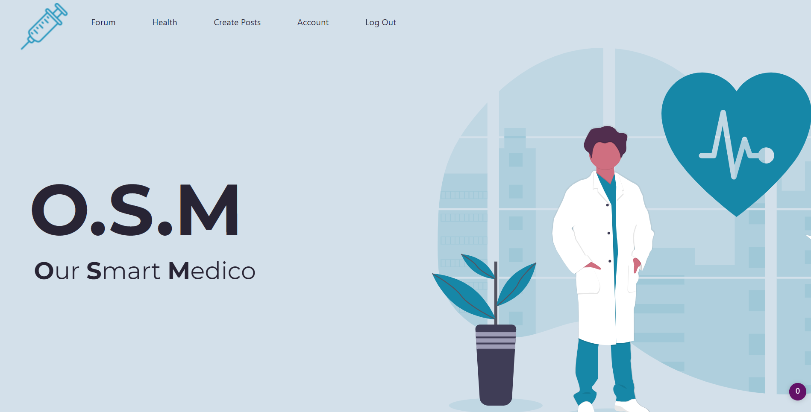
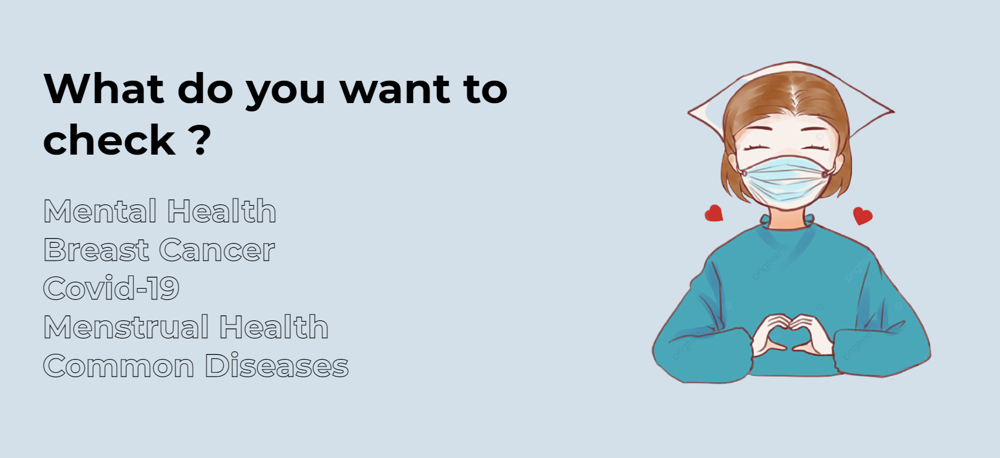
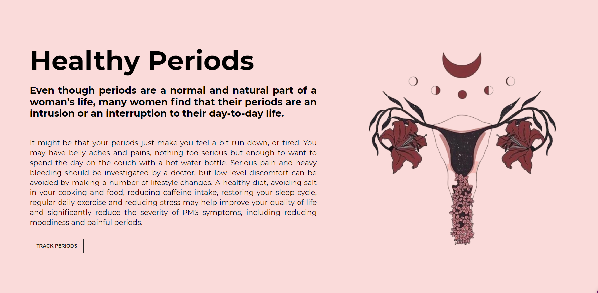
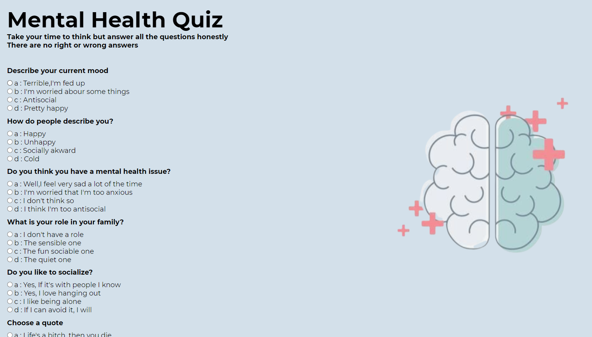
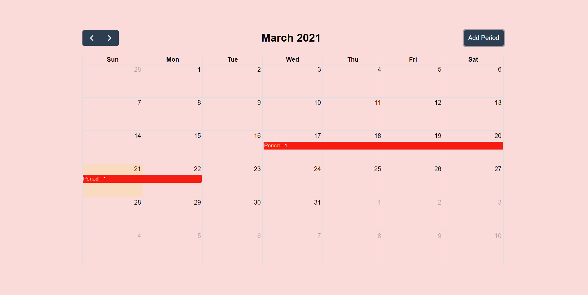
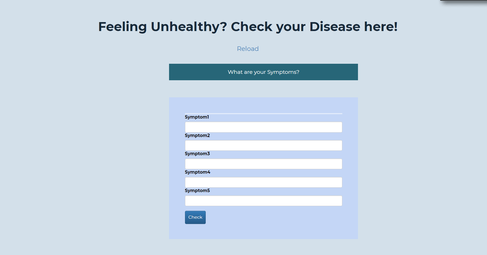
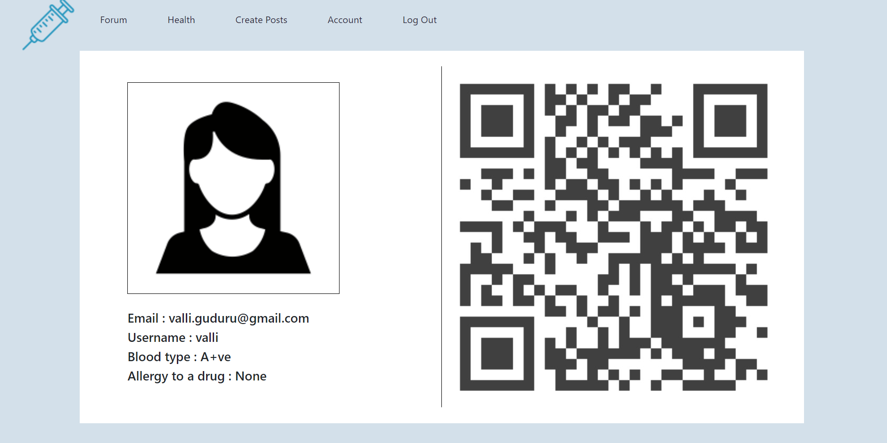
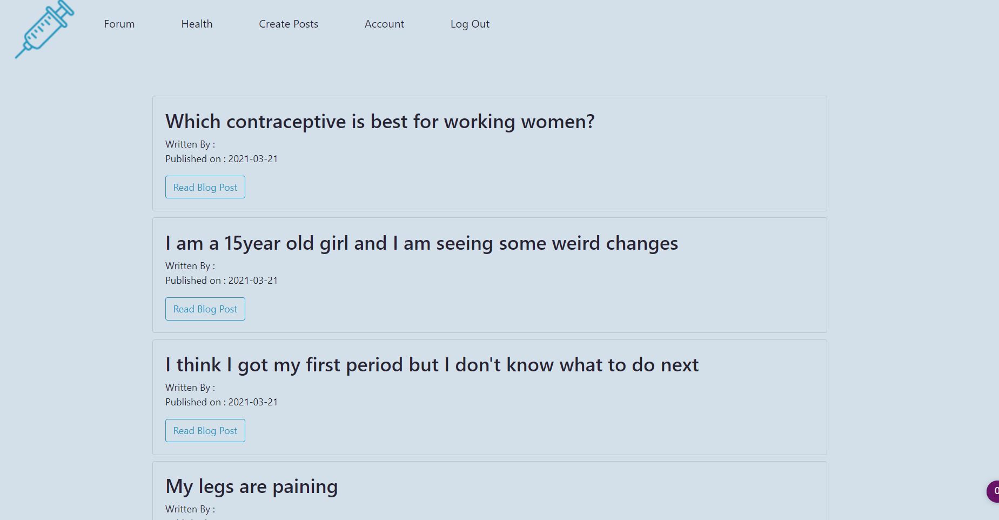
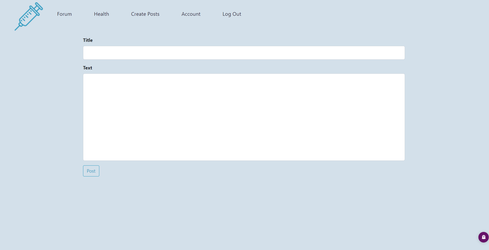

  <h1>HACK NITR </> 2021</h1>

  <h1>O.S.M</h1>
  
  
Our Smart Medico 🏥

  
Immune 🩺 and Inspire 💙 

## What we had in mind when we built this ?

Among all the deaths that occur in the Emergency departments, 23.8% were due to preventable causes. This percentage can be clearly reduced if the doctors operated on the patients a little early. So it the doctor's fault then? No. Doctors are not able to act quickly because they have to check the patient's health status which most of the time includes blood group, drug allergies, and common diseases like high blood pressure or diabetes the patient might be having. Even with the highly sophisticated medical equipment we have right now, it takes at least 2 to 3 hours to run all these tests. This is what we wanted to solve using a Quick Response code(QR Code). One-click and all the medical history of the patient in the doctor's hands. We also wanted to expand our platform to efficient diagnostic AI models which would help doctors to diagnose patients more accurately, make predictions about patients’ future health, and recommend better treatments. In addition to this, we also desired to provide a healthy space to all those people who question their body and not comfortable in talking to other people about it. Especially for teenagers who are going through puberty. It is like a community of people self-discovering themselves without having to fear stigma and judgment. But..we were missing something. All of this was just about physical health. According to WHO, nearly 20% of Indians are mentally ill, and worst of all,90% of them don't even realize that. This is why we also wanted to include mental health quizzes.

 

## Our Features : 

* A forum 📝 for all users to post and read about embarassing yet important dobuts on bodies.
* Highly accurate machine learning models 💻 for common diseases prediction according to symptoms,Covid-19 and Melanoma detection using X-Rays.
* Mental Health quizzes 🧠 which would help a person know if he/she has any symptoms of a mental health disorder.
* A unique QR Code for all users storing their medical history.
* A Menstrual Health Tracker for all the women.🔴
* Amazingly smooth UI for extraordinary user experience.💥
 

## How does our application looks like ? 

 

 

 

 

 

## Challenges we came across : 
* Integrating Machine learning models into our web app.
* Implementing User authentication and handling database.
* Transferring data from flask to javaScript.

 

## Tech Stack : 

* HTML
* CSS
* JavaScript
* Bootstrap 
* Flask 
* scikit-learn
* keras
* Jinja templating
* SQL Alchemy
* SQlite
 

## Team Members (Coding Divas) :

* Padmaja Buggaveeti
* Prathyusha Guduru
